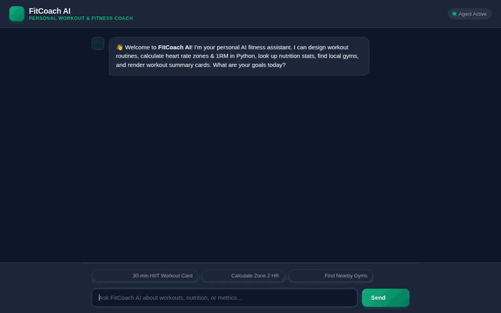

# 🏋️‍♂️ FitCoach AI — Personal AI Fitness & Health Assistant

FitCoach AI is an intelligent fitness coaching application powered by Google Cloud's **Agent Development Kit (ADK)** and Vertex AI platform. It provides personalized workout routines, heart rate & metric calculations, database workout logging, AI-generated exercise diagrams and videos, and interactive A2UI rich visual cards.



---

## 🔥 Features & Integrated Google Cloud Services

FitCoach AI connects to Google Cloud services and ADK features to deliver a complete fitness experience:

| Feature / Service | Description & Implementation |
| :--- | :--- |
| **Agent Development Kit (ADK)** | Built on Google ADK 1.1.0 using `Llama-3`-class or Gemini foundation models with multi-turn conversation and tool orchestration. |
| **A2UI (Agent to User Interface)** | Integrates `a2ui-agent-sdk` (Schema v0.8) & `BasicCatalog` as an `after_model_callback` to render interactive workout summary cards, exercise tables, and metric breakdowns. |
| **Vertex AI Memory Bank** | Cross-session long-term memory via `PreloadMemoryTool` and `generate_memories_callback` to remember user fitness goals, resting HR, and exercise preferences across sessions. |
| **Google Cloud Firestore** | NoSQL database storage powering workout logging (`log_completed_workout`), exercise searches (`search_exercises`), and exercise catalog updates (`add_exercise`). |
| **Google Cloud Storage (GCS)** | Public asset bucket storing generated exercise diagrams, motivational imagery, and MP4 exercise animation videos. |
| **Generative AI Image Generation** | Uses `gemini-3.1-flash-lite-image` to generate custom visual workout guides and motivational images on-the-fly. |
| **Generative AI Video Generation** | Uses `gemini-omni-flash-preview` in region `global` via Vertex AI Interactions API to generate animated exercise videos saved as ADK artifacts and hosted on GCS. |
| **Vertex AI RAG Engine** | Grounded Retrieval Augmented Generation querying herbal and natural supplement corpora (`consult_herbal_corpus`). |
| **Python Code Execution Sandbox** | Dynamic Python executor (`execute_python_code`) computing Zone 2 Karvonen Heart Rate ranges, 1-Rep Max (1RM), BMR, and macro ratios safely. |
| **Google Places & Geocoding** | Integrates Google Maps APIs to geocode locations (`geocode_address`) and locate nearby fitness centers, gyms, and health food stores (`find_nearby_places`). |

---

## 🛠️ Project Structure

```
fitcoach-ai/
├── app/                        # Agent backend codebase
├── agents-cli-manifest.yaml    # ADK deployment manifest (target: agent_runtime)
├── demo.gif                    # Recorded interactive demo GIF
├── fitcoach_ai_demo.webm       # High-definition demo recording
├── record_demo.py              # Automated Playwright video recorder
└── frontend/                   # Web frontend & proxy server
    ├── main.py                 # FastAPI proxy server (A2A protocol -> Agent Engine)
    └── static/                 # HTML5 UI with Outfit typography & Emerald styling
```

---

## 🚀 Local Setup & Run Guide

### Prerequisites
- **Python**: 3.10+
- **Google Cloud SDK (`gcloud`)**: Authenticated with `gcloud auth login` and `gcloud auth application-default login`.
- **`uv` package manager**: `pip install uv`

### Step 1: Install Dependencies
```bash
# Install backend dependencies
uv sync

# Install frontend dependencies
cd frontend
uv sync
```

### Step 2: Configure Environment Variables
Set the required Google Cloud variables for your GCP project and deployed Agent Runtime instance:

```bash
export GOOGLE_CLOUD_PROJECT="<YOUR_GCP_PROJECT_ID>"
export AGENT_ENGINE_RESOURCE_NAME="projects/<PROJECT_NUMBER>/locations/us-east1/reasoningEngines/<RESOURCE_ID>"
export AGENT_DIRECTORY="app"
```

### Step 3: Start Local Web Frontend
```bash
cd frontend
uv run python main.py
```

The frontend web interface will launch and serve requests on your local server port `8080`.

---

## 🧪 Testing & Verification

To verify agent capabilities locally:
1. Run local testing via ADK CLI:
   ```bash
   adk web app
   ```
2. Run automated end-to-end demo recording script:
   ```bash
   uv run python record_demo.py
   ```
